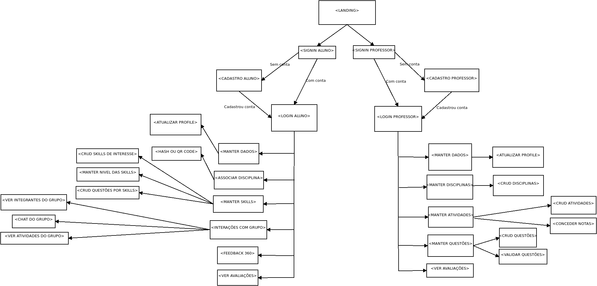

# Trabalho AV1 - Desenvolvimento de Aplicações Móveis

## Grupo:

    Lucas Guimarães Cavalheiro - 2012200347

Para rodar a aplicação, basta instalar as dependências citadas no package.json e usar `expo start`.

Relatório sobre o firebase foi produzido com a ajuda dos alunos de desenvolvimento de aplicações distribuídas:

    Felipe Bento Xavier - 2017102868
    Luís Henrique de C. Corrêa - 2017102465

